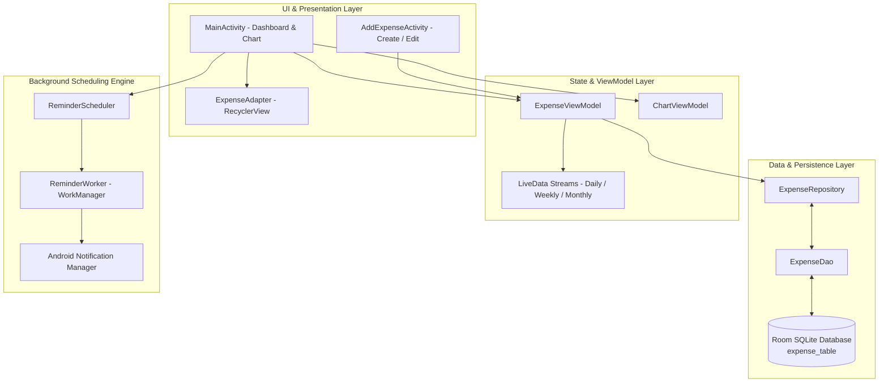

# ExpenseTracker

[](https://www.android.com/)
[](https://kotlinlang.org/)
[](https://developer.android.com/topic/architecture)
[](https://developer.android.com/training/data-storage/room)
[](https://github.com/PhilJay/MPAndroidChart)
[](https://developer.android.com/)
[-00BCD4?style=for-the-badge)](https://developer.android.com/)
[](LICENSE)

> A modern Android personal finance and expense tracking application featuring category budgeting, interactive MPAndroidChart spending analytics, Room SQLite persistence, and WorkManager daily logging reminders.

---

## 📖 Overview

**ExpenseTracker** is a native Android financial management utility designed to help users track personal expenditures, analyze budget allocations by category, and maintain consistent daily logging habits. 

Built with **Modern Android Development (MAD)** principles, the application provides an instant graphical breakdown of spending patterns through interactive pie charts, dynamic time-range filters (**Today**, **This Week**, **This Month**, and **All-Time**), persistent Room SQLite storage, and automated daily reminders powered by AndroidX `WorkManager`.

### Key Highlights
- **Visual Spending Analytics**: Real-time category aggregation rendered dynamically via `MPAndroidChart` with customized pastel palettes and interactive legends.
- **Granular Time-Range Filters**: One-tap query switches between Daily, Weekly, and Monthly expense summaries.
- **Offline Room Persistence**: Immediate on-device SQLite storage with reactive `LiveData` streams.
- **Habit-Building Reminders**: Automated background notification scheduling via `WorkManager` ensuring expenses are logged daily.

---

## 🏗️ Architecture & Data Flow

ExpenseTracker is structured according to the standard **MVVM (Model-View-ViewModel)** and **Repository** architectural pattern.



---

## ✨ Core Features

### 📊 Dynamic Spending Breakdown (MPAndroidChart)
- **Category Grouping**: Dynamically groups transactions into distinct categories (*Food, Transport, Utilities, Entertainment, Shopping, Health, etc.*) and computes spending percentages.
- **Custom Aesthetic**: Rendered with soft pastel color palettes, anti-aliased slices, hidden clutter values, and centered bottom legends.
- **Live Total Spend Metric**: Real-time calculated spend totals displayed above transaction feeds.

### 📅 Time-Window Expense Filtering
- **Daily View**: Queries and isolates expenses logged for the current calendar date (`yyyy-MM-dd`).
- **Weekly View**: Filters expenses within the current Monday-to-Sunday weekly date span using `ThreeTenABP` / `LocalDate`.
- **Monthly View**: Queries expenses matching the current calendar month prefix.
- **All-Time View**: Comprehensive transaction ledger ordered chronologically descending.

### 📝 Complete Transaction CRUD
- **Create & Edit**: Intuitive transaction editor capturing amount, category dropdown selection, custom notes, and a calendar DatePicker dialog.
- **Instant Deletion**: Long-press on any ledger item to delete the record from Room with instant UI reconciliation and toast notification.

### ⏰ Automated WorkManager Reminders
- **Periodic Work Scheduling**: Background worker dispatched via AndroidX `WorkManager` to remind users to log daily expenses.
- **Notification Channel**: Supports Android 8.0+ notification channels and Android 13+ runtime permissions.

---

## 📱 Key Screens & UI Components

| Screen / Component | Class | Description |
|---|---|---|
| **Dashboard Screen** | `MainActivity` | Displays the MPAndroidChart pie chart, total spending banner, filter buttons, and transaction RecyclerView. |
| **Add / Edit Expense** | `AddExpenseActivity` | Transaction input form with amount formatting, category selection, date picker, and note input. |
| **Transaction List** | `ExpenseAdapter` | RecyclerView adapter rendering category icons, note descriptions, dates, and amounts. |
| **Background Worker** | `ReminderWorker` | WorkManager coroutine worker responsible for posting daily logging notifications. |
| **Scheduler** | `ReminderScheduler` | Helper class configuring periodic work requests and initial delay offsets. |

---

## 🛠️ Technical Stack Matrix

| Layer / Concern | Technology / Library | Version / Details |
|---|---|---|
| **Platform** | Android OS | `minSdk 24` (Android 7.0) / `targetSdk 35` (Android 15) / `compileSdk 35` |
| **Language** | [Kotlin](https://kotlinlang.org/) | 1.9+ |
| **Architecture** | MVVM + Repository Pattern | Android Jetpack Lifecycle (`ViewModel`, `LiveData`) |
| **Database** | [Room Persistence Library](https://developer.android.com/training/data-storage/room) | `2.6.1` with Kotlin KAPT annotation processor |
| **Charting Engine** | [MPAndroidChart](https://github.com/PhilJay/MPAndroidChart) | `v3.1.0` interactive pie chart engine |
| **Background Tasks** | [AndroidX WorkManager](https://developer.android.com/topic/libraries/architecture/workmanager) | `2.9.0` for reliable background reminders |
| **Date & Time** | [ThreeTenABP](https://github.com/JakeWharton/ThreeTenABP) | `1.4.5` backport of Java 8 date/time APIs for Android |
| **Animations** | [Lottie Android](https://github.com/airbnb/lottie-android) | `6.4.0` vector animation engine |
| **UI Components** | AndroidX Material Design 3 | FloatingActionButton, RecyclerView, CardView, Custom Drawables |

---

## 📂 Project Structure

```text
ExpenseTracker/
├── app/
│   ├── src/
│   │   ├── main/
│   │   │   ├── java/com/nayab/linearlayout/
│   │   │   │   ├── adapter/
│   │   │   │   │   └── ExpenseAdapter.kt          # RecyclerView adapter with edit/delete callbacks
│   │   │   │   ├── data/
│   │   │   │   │   ├── ExpenseDao.kt              # Room DAO queries for date ranges & summaries
│   │   │   │   │   ├── ExpenseDatabase.kt         # Room database singleton
│   │   │   │   │   └── ExpenseEntity.kt           # Expense table data model
│   │   │   │   ├── repository/
│   │   │   │   │   └── ExpenseRepository.kt       # Clean repository mediating Room operations
│   │   │   │   ├── ui/
│   │   │   │   │   ├── MainActivity.kt            # Main dashboard & MPAndroidChart host
│   │   │   │   │   └── AddExpenses.kt             # Add and edit expense activity
│   │   │   │   ├── utils/
│   │   │   │   │   ├── ReminderScheduler.kt       # WorkManager schedule initiator
│   │   │   │   │   └── ReminderWorker.kt          # Background notification worker
│   │   │   │   └── viewmodel/
│   │   │   │       ├── ChartViewModel.kt          # Chart calculation state
│   │   │   │       ├── ExpenseViewModel.kt        # Primary expense state & queries
│   │   │   │       └── ExpenseViewModelFactory.kt # ViewModel Provider Factory
│   │   │   ├── res/
│   │   │   │   ├── layout/
│   │   │   │   │   ├── activity_main.xml          # Dashboard layout with PieChart & RecyclerView
│   │   │   │   │   ├── activity_add_expense.xml   # Transaction input form
│   │   │   │   │   └── expense_item.xml           # List item card layout
│   │   │   │   └── values/                        # Color schemes, strings, and themes
│   │   │   └── AndroidManifest.xml
│   ├── build.gradle.kts
│   └── proguard-rules.pro
├── gradle/
│   └── libs.versions.toml
├── build.gradle.kts
├── LICENSE
└── README.md
```

---

## 🚀 Getting Started

### Prerequisites
- **Android Studio** (Ladybug 2024.2+ or Hedgehog+).
- **JDK 17** or **JDK 21**.
- Android device or Emulator running **API 24 (Android 7.0)** or above.

### Installation & Build

1. **Clone the repository**:
   ```bash
   git clone https://github.com/shayann07/ExpenseTracker.git
   cd ExpenseTracker
   ```

2. **Open in Android Studio**:
   - Open the directory in Android Studio and let Gradle sync complete.

3. **Build the Debug APK**:
   ```bash
   ./gradlew assembleDebug
   ```

4. **Install & Run**:
   ```bash
   ./gradlew installDebug
   ```

---

## 📄 License

This project is licensed under the **MIT License** — see the [LICENSE](LICENSE) file for complete details.

```text
Copyright (c) 2026 shayann07
```
